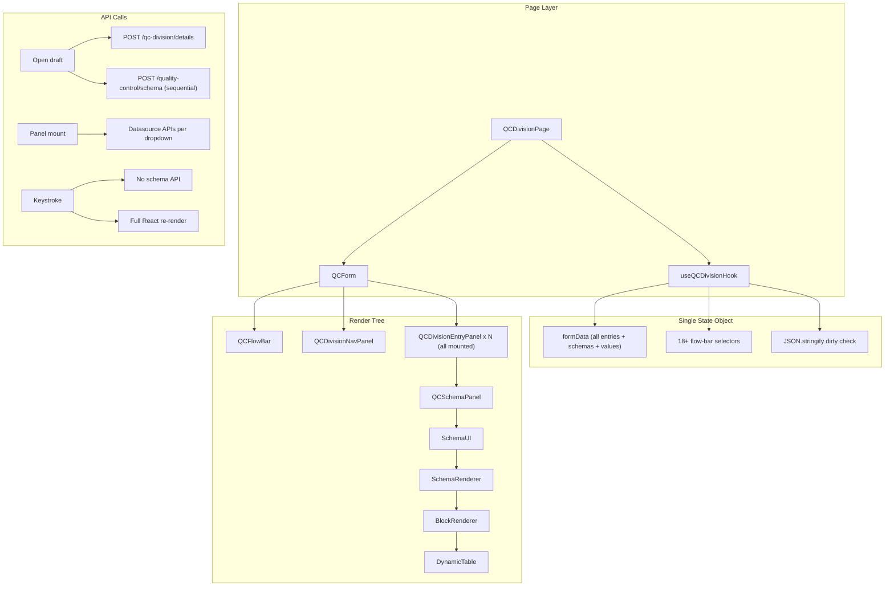
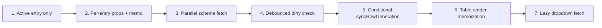

# QC Division Form Performance Analysis and Optimization Plan

## Current Architecture



**Key files:**
- Hook/state: [`src/hooks/user/qualityControl/useQCDivisionHook.ts`](src/hooks/user/qualityControl/useQCDivisionHook.ts) (~1727 lines, all QC form state)
- Form shell: [`src/ui/pages/user/qualityControl/QCDivision/QCForm.tsx`](src/ui/pages/user/qualityControl/QCDivision/QCForm.tsx)
- Entry wrapper: [`src/ui/pages/user/qualityControl/QCDivision/QCDivisionEntryPanel.tsx`](src/ui/pages/user/qualityControl/QCDivision/QCDivisionEntryPanel.tsx)
- Schema adapter: [`src/ui/pages/user/qualityControl/QCDivision/QCSchemaPanel.tsx`](src/ui/pages/user/qualityControl/QCDivision/QCSchemaPanel.tsx)
- Schema engine: [`src/schema-engine/SchemaRenderer.tsx`](src/schema-engine/SchemaRenderer.tsx), [`src/schema-engine/BlockRenderer.tsx`](src/schema-engine/BlockRenderer.tsx), [`src/ui/components/common/DynamicTable.tsx`](src/ui/components/common/DynamicTable.tsx)
- Dropdown APIs: [`src/schema-engine/rules/apiDependency.ts`](src/schema-engine/rules/apiDependency.ts) (module-level promise cache exists)

---

## Integration Flow (What Happens When)

### Form open / edit (slow load)
1. `handleFillForm` / `handleEditForm` calls `openFormWithResolvedData` in [`useQCDivisionHook.ts`](src/hooks/user/qualityControl/useQCDivisionHook.ts).
2. **Details API** — `qcDivisionController.fetchFormDetails(formId)` returns all saved `divisionDetails`.
3. **Schema queue** — unique `(division, subType)` pairs are deduped into `schemaFetchQueue`.
4. **Sequential schema fetch** — each schema is fetched one-by-one (`for...await`), not in parallel:

```1381:1391:src/hooks/user/qualityControl/useQCDivisionHook.ts
for (const [, request] of schemaFetchQueue) {
  const cacheKey = getQcSchemaCacheKey(request.division, request.subType);
  try {
    const result = await fetchQcSchemaDocument(request.division, request.subType);
    if (result) {
      schemasByKey[cacheKey] = result.schema;
    }
  } catch {
    // individual schema fetch failure should not abort the entire flow
  }
}
```

5. **Hydration** — saved sections are mapped into `divisionEntryValues` and `mixingFinalMixDetailsValues`.
6. **All entry panels mount** — even inactive tabs are rendered (hidden via CSS).

A draft with Revalidation + Solid/Liquid Processing + Mixing + Hardware + Casting can easily trigger **1 details call + 6–10 schema calls + dozens of dropdown datasource calls** on first paint.

### Adding a division (moderate load)
- `handleLoadQcForm` fetches schema only on cache miss (`formData.schemasByKey`).
- Hardware with multiple processes fetches sequentially per process type.
- `BOTH_PREMIX` fetches solid + liquid schemas.

### Typing in a field (input lag — no extra schema API)
1. Field `onChange` → `setBlockValue` (immutable copy of full entry values).
2. `SchemaRenderer.handleChange` runs on **every** change:
   - `syncRowGenerationTables(schema, next)` — full schema tree walk, up to 4 passes
   - `pruneHiddenFormValues(sections, synced)` — another full values walk
3. `handleDivisionEntryValuesChange` spreads entire `formData`.
4. `formSnapshot` re-runs `JSON.stringify` over full form + all flow-bar state.
5. `QCForm` re-renders and passes new `formData` to **all** entry panels.

```364:381:src/ui/pages/user/qualityControl/QCDivision/QCForm.tsx
{divisionEntries.map((entry) => (
  <Box
    key={entry.entryId}
    sx={{ display: isDivisionEntryVisible(entry, activeContent) ? "block" : "none" }}
  >
    <QCDivisionEntryPanel entry={entry} formData={formData} ... />
  </Box>
))}
```

**No `React.memo` anywhere in the QCDivision folder.** Hidden panels still reconcile full schema trees (tables, dropdowns, formulas).

---

## Root Cause Summary

| Symptom | Primary cause | Severity |
|---------|---------------|----------|
| Slow draft open | Sequential schema fetches + details hydration + all panels mount + dropdown mount fetches | High |
| Input lag / typing delay | Full-form re-render on every keystroke across all mounted entries | Critical |
| Input lag in tables | `syncRowGenerationTables` + formula eval + commit-group O(n²) work per change | High |
| Dropdown slowness on open | Every mounted (including hidden) panel fires dropdown `useEffect` on mount | Medium |
| Dirty-check cost | `JSON.stringify(formData)` on every keystroke | Medium |

**What is already working:**
- Schema documents are cached in `schemasByKey` after first load (no re-fetch per keystroke).
- Dropdown option requests are deduped via `schemaApiListCache` in [`apiDependency.ts`](src/schema-engine/rules/apiDependency.ts).

---

## Optimization Plan (Phased)

### Phase 1 — Quick wins (highest ROI, lowest risk)

**1. Mount only the active division entry**
- In [`QCForm.tsx`](src/ui/pages/user/qualityControl/QCDivision/QCForm.tsx), replace `display: none` with conditional render of the active `QCDivisionEntryPanel` only.
- Keep final-mix-details panel separate (already conditional).
- Expected impact: typing in one division no longer reconciles 5–15 hidden full schema trees.

**2. Stop passing whole `formData` to each entry panel**
- Change [`QCDivisionEntryPanel.tsx`](src/ui/pages/user/qualityControl/QCDivision/QCDivisionEntryPanel.tsx) props to receive only:
  - `entryValues` for that entry
  - `schema` from `getSchemaForDivisionEntry(formData, entry)` (resolved in parent `useMemo`)
- Wrap panel in `React.memo` with stable `onEntryValuesChange` keyed by `entryId` (use a ref map or `useCallback` factory in hook).

**3. Parallelize schema fetches on draft open**
- In `openFormWithResolvedData`, replace sequential `for...await` with `Promise.all` over `schemaFetchQueue` entries.
- Add in-flight dedup in `fetchQcSchemaDocument` (module-level `Map` like dropdown cache) to prevent duplicate concurrent schema requests.

**4. Debounce dirty-check serialization**
- In [`useQCDivisionHook.ts`](src/hooks/user/qualityControl/useQCDivisionHook.ts), replace per-keystroke `JSON.stringify(formData)` with:
  - a `dirtyRef` set `true` on any value change, or
  - debounced snapshot (300–500ms) for back-navigation confirm only.
- Dirty tracking does not need to block typing.

**5. Fix `SchemaReadonlyDisplay` apiContext churn**
- In [`SchemaReadonlyDisplay.tsx`](src/ui/components/common/SchemaReadonlyDisplay.tsx), use `JSON.stringify(apiContext)` in effect deps (same pattern as `SchemaApiDropdown`) to avoid re-running effects when parent passes a new object reference with same values.

---

### Phase 2 — Schema engine hot-path (medium effort)

**6. Skip expensive sync when not needed**
- In [`SchemaRenderer.tsx`](src/schema-engine/SchemaRenderer.tsx), only call `syncRowGenerationTables` when the changed block is a row-generation table or its parent source changed.
- Only call `pruneHiddenFormValues` when visibility-affecting fields changed.
- Pass change metadata from `BlockRenderer` / `DynamicTable` (blockId or columnId).

**7. Memoize table render work in `DynamicTable`**
- Precompute `expandedGroupCellSpans`, divider flags once per `rows` change (not per cell render).
- Memoize row components or use `useMemo` for row cell arrays.
- Fix row keys from `rowIndex` to stable `_key` / `SR_NO` where possible.

**8. Optimize formula evaluation**
- In [`formulaEval.ts`](src/schema-engine/rules/formulaEval.ts), cache parsed expressions per formula string.
- In `DynamicTable.updateCell`, only recalculate formula columns that depend on the changed column.

**9. Lazy-load dropdown options**
- Defer `SchemaApiDropdown` fetch until dropdown is opened (MUI `Select` `onOpen`) instead of on mount.
- Big win when many hidden panels or large tables have API dropdowns.

**10. Remove `formValues` from hydration effect deps**
- In [`QCSchemaPanel.tsx`](src/ui/pages/user/qualityControl/QCDivision/QCSchemaPanel.tsx), hydration effect should not list `formValues` as a dependency; rely on `hydrationKey` + `savedSections` only.

---

### Phase 3 — Structural improvements (longer term)

**11. Split form state by entry**
- Move `divisionEntryValues[entryId]` updates to entry-scoped state or a lightweight store (Zustand slice per entry, or `useReducer` per panel).
- Parent only tracks entry list + schemas; typing does not clone full `formData`.

**12. Memoize schema render boundaries**
- `React.memo(BlockRenderer)` with per-section `values` slice.
- Stable `ctx` per section instead of one global object recreated every render.

**13. Virtualize large tables**
- For commit-group / raw-material tables with 10+ rows, virtualize rows in `DynamicTable` (e.g. react-window) to reduce DOM nodes.

**14. Backend coordination (optional)**
- Composite schema/details endpoint for draft open (single round-trip).
- Batch schema fetch API: `POST /quality-control/schemas` with array of `{division, subType}`.

---

## Recommended Implementation Order



**Expected impact after Phase 1 alone:**
- Input responsiveness: large improvement (main user complaint).
- Draft open: moderate improvement (parallel schemas + fewer mount-time dropdown fetches).

**Measurement approach (before/after):**
- React Profiler: record commit duration on single text field keystroke with 5+ division entries loaded.
- Network tab: count schema + dropdown calls on draft open.
- `performance.mark` around `handleDivisionEntryValuesChange` → paint.

---

## Out of Scope / Not Recommended Now

- Rewriting entire schema engine to react-hook-form — too large for first pass.
- Removing immutable updates — correctness risk; better to isolate re-renders than change update model globally.
- Caching schema HTTP at service-worker level — in-memory + parallel fetch is sufficient initially.

## Risk Notes

- **Conditional mount vs `display:none`:** switching tabs will unmount inactive entries; ensure values persist in `divisionEntryValues` (they already do) and test tab switching does not lose unsaved edits.
- **Parallel schema fetch:** watch for rate limiting on backend; cap concurrency (e.g. `p-limit` with 3–4) if needed.
- **Skipping `syncRowGenerationTables`:** must be conservative — only skip when schema has no `rowGenerationSource` tables or change is unrelated.
